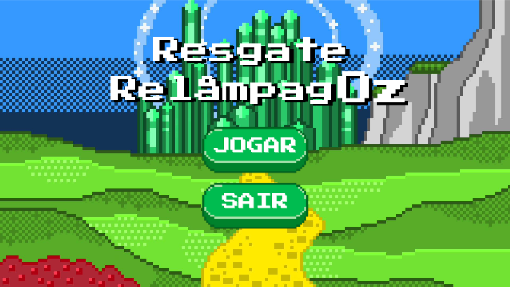
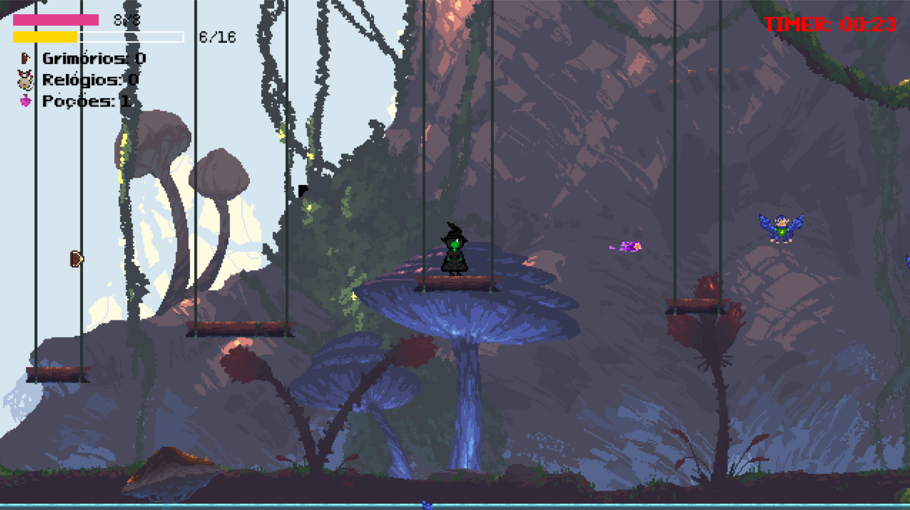
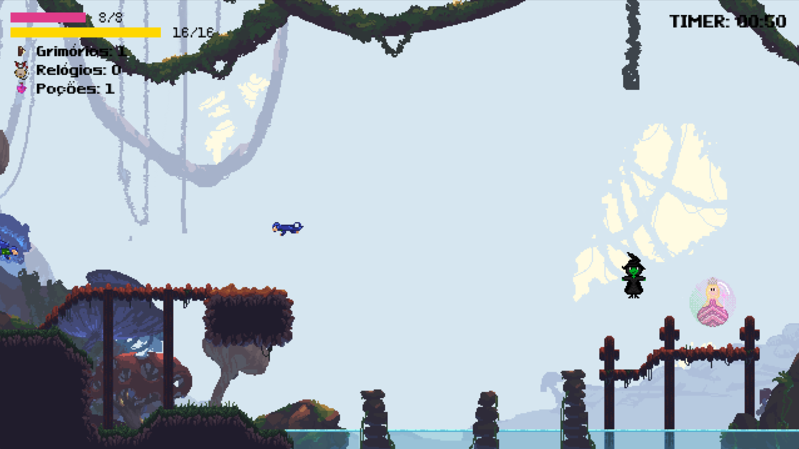
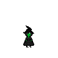
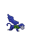
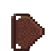
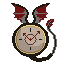

# **Resgate RelampagOz🧙🏽👸🏼**

Não há tempo a perder! Vidas estão em jogo, e Elphaba precisa resgatar Glinda antes que o tempo acabe. Mas não ache que é tão fácil assim... A floresta da Terra de Oz está cheia de macacos voadores e áreas perigosas que podem custar a vida de Elphaba. Colete grimórios para recarregar seus feitiços, poções de cura para recuperar a vida e relógios do dragão para parar o tempo... Salve a Glinda!!

## Capturas de Tela
<p align="center">
  
</p>

<p align="center">
  
  
</p>

# Como Jogar
**Objetivo do jogo:** Glinda foi sequestrada e encontra-se cercada por macacos voadores. Agora, Elphaba precisa enfrentar esses lacaios e atravessar os perigos do caminho para resgatá-la em segurança. O jogo termina quando Elphaba alcança Glinda.

### Personagens
**Player principal:** Elphaba, a bruxa má do Oeste. 

**Objetivo do resgate:** Glinda, a bruxa boa. 

**Inimigo:** Macaco Voador. 

### Coletáveis
**Recarga de munição:** Grimório da Elphaba. 

**Recupera a vida:** Poções de cura. 

**Congela o timer:** Relógio do dragão. 

# Como Baixar
* Aqui repositório do GitHub, selecione a alternativa “<> Code” e copie a URL;
* Verifique se o seu Visual Studio Code tem a versão atualizada do python;
* No terminal do VSCode, digite o comando ```pip install pygame```;
* Ainda no terminal, digite o comando ```pip install pytmx```;
* Após as instalações, também no terminal, digite ```git clone + URL``` e salve o projeto;


# Equipe
* Arthur Araújo do Nascimento (aan5@cin.ufpe.br)
* Leon Gonçalves Galvão Santos (lggs@cin.ufpe.br)
* Maria Clara de Oliveira Melo (mcom@cin.ufpe.br)
* Matheus Reis Rodrigues da Silva (mrrs@cin.ufpe.br)
* Sophia Santos Freire de Sá (ssfs@cin.ufpe.br)

# Divisão do Trabalho
A distribuição das tarefas foi definida conforme as necessidades do jogo e houve pessoas que trabalharam tanto na parte gráfica do jogo como na programação.
Membros da Equipe | Tarefas Realizadas
----------------- |----------------
Arthur            |  Criação das sprites dos coletáveis, trilha sonora e implementação dos sons no código
Leon              | Programação principal, mecânica de side-scroller, lógica dos inimigos
Maria Clara       | Programação principal, lógica do player e dos três coletáveis, tela de pausa, slides, criação e implementação do HUD e organização do código em módulos
Matheus           | Programação principal, criação das sprites dos personagens, capa do jogo, construção do mapa, implementação de personagem, tela de menu 
Sophia            | Criação das sprites do inimigo e coletáveis, tela de menu e game over, relatório final e slides


# Arquitetura do Código 
A organização do código baseia-se na modularização dos arquivos, sendo eles:
Módulos               | Funcionalidades
--------------------- | -------------
Hud (Head-Up Display) | Arquivo o qual dispõe das funções que “desenham” informações na interface do jogo como a barra de status, timer, contadores de coletáveis, game over, tela de pausa, botões, etc. 
Jogador               | É neste módulo em que a Classe que contém todos os Métodos do player principal é implementada. Executam o movimento do personagem, animações das sprites, ações como “atirar”, resetar após derrota ou vitória.
Main                  | Responsável por orquestrar todos os módulos, gerenciando uma máquina de estados, a qual alterna entre Menu, Jogo, Pausa, Vitória e Game over. Controla, também, o loop principal, side-scroller, músicas e efeitos, etc.
Mapa                  | Responsável por por carregar e gerenciar mapas criados no software Tiled (formatdo.tmx) para um jogo em Pygame através da biblioteca pytmx, o que permite a execução de colisões e implementa com sucesso as plafaformas.
Objetos               | Inclui as classes dos demais objetos presentes no jogo: Glinda, inimigos, Relógio, elixir, Grimmerie.
Settings              | Centraliza em um único módulo as configurações das variáveis que serão utilizadas durante o código.

# Ferramentas Utilizadas
* VSCode (Editor de código para a programação)
* GitHub (Plataforma baseada em nuvem onde o código foi armazenado)
* Pygame (Biblioteca voltada para o desenvolvimento de jogos e demais aplicações multimídia)
* Tiled (Editor visual de mapas 2D)
* Pytmx (biblioteca Python que permite ler e interpretar arquivos .tmx criados no Tiled.)

# Conceitos aprendidos na disciplina presentes no código
* **Estruturas condicionais:** 
    >Presente em grande parte dos módulos, são elas: movimentação do player principal, troca de estados, animações das sprites, condicionais dos coletáveis

* **Laços de repetição:** 
    >Ler camadas de colisão do mapa, dentro da função desenhar 

* **Funções:** 
    >Utilizadas para a implementação de métodos dentro de todas as classes, eventos de desenhar na tela, trilha sonora

* **Listas:** 
    >Animação das sprites, guardar coletáveis no HUD, definir elementos de colisão no mapa


# Qual foi o maior erro cometido durante o projeto? Como vocês lidaram com ele?
>O maior erro da nossa equipe foi não termos estabelecido uma rotina de reuniões em grupo logo no início, pois percebemos tardiamente que o trabalho fluía com muito mais agilidade quando estávamos juntos. Corrigimos isso a partir dos primeiros checkpoints com o monitor. Vale ressaltar que essa falha inicial não prejudicou nossa comunicação, que foi excelente, mas sim a otimização do nosso ritmo de entregas, visto o curto período para entregar o projeto.


# Qual foi o maior desafio enfrentado durante o projeto? Como vocês lidaram com ele?
>O maior desafio do projeto foi a transição para o paradigma de Programação Orientada a Objetos (POO) e a modularização do código. Por serem conceitos novos para a equipe e com um cronograma de entrega apertado, conciliar o aprendizado técnico com a gestão eficiente das tarefas foi complexo. Superamos esse obstáculo através de pesquisas intensas e uma comunicação constante.

# Quais as lições aprendidas durante o projeto?
>As principais lições aprendidas envolveram o fortalecimento do trabalho em equipe, especialmente o desenvolvimento colaborativo. Compreendemos a importância de escrever um código limpo e legível que todos pudessem entender, superando o desafio de alinhar as diferentes lógicas e estilos individuais de programação. Essa experiência nos mostrou que a clareza na escrita do código e a capacidade de interpretar o trabalho do colega são fundamentais para a manter o projeto organizado.